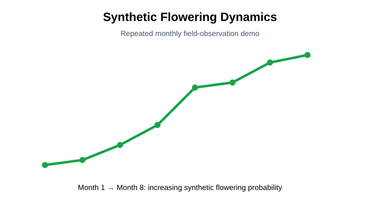
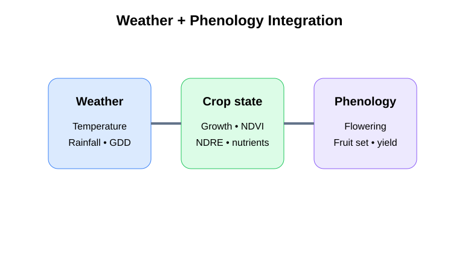
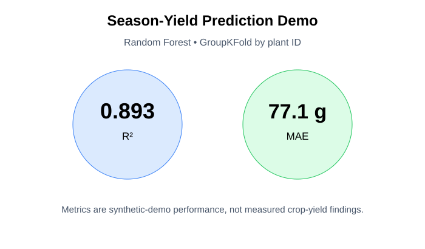
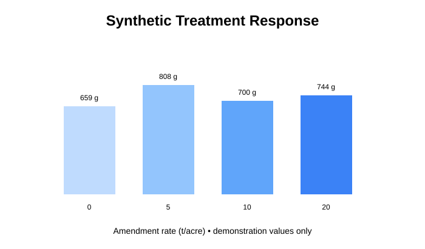
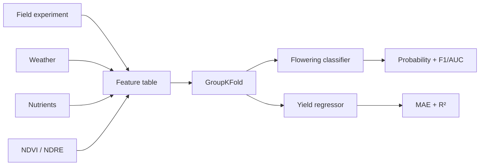

# Dragon Fruit Yield & Flowering Forecasting

**Predictive ML • time series • weather • field experiments • grouped validation**

A recruiter-ready agricultural data-science project demonstrating how repeated field observations, management treatments, weather, nutrients, growth, and vegetation indices can be integrated to model **flowering probability and season-level yield**.

> **Transparency:** all public observations and model metrics in this project are generated from synthetic demonstration data. They are not unpublished doctoral measurements or biological findings.

## Recruiter summary

- 72-plant factorial experimental structure
- 576 repeated observations across eight time periods
- weather + field + nutrient + spectral/vegetation-index feature integration
- flowering classification and season-yield regression
- Random Forest modeling
- **GroupKFold by plant ID** to reduce repeated-measure leakage
- feature importance and model diagnostics
- reproducible scripts, notebooks, tests, figures, and machine-readable results

## Demonstration metrics

| Task | Metric |
|---|---|
| Flowering classification | Accuracy **0.830**, F1 **0.848**, ROC AUC **0.890** |
| Season-yield regression | MAE **77.1 g**, R² **0.893** |

These are synthetic-demo results only.

## Visual results

| Flowering dynamics | Weather / phenology |
|---|---|
|  |  |

| Yield prediction | Treatment response |
|---|---|
|  |  |

## Workflow



## Run locally

```bash
pip install -r requirements.txt
python scripts/run_demo.py
python -m pytest -q
```

Running the demo regenerates the full 576-row synthetic table and all result files.

## Decision question

**Which combinations of crop, management, environmental, nutrient, spectral, and weather variables are most predictive of flowering and yield-related outcomes?**

## Transferability

The same architecture can be retrained for another crop only with crop-specific ground truth, appropriate target definitions, and independent validation.
