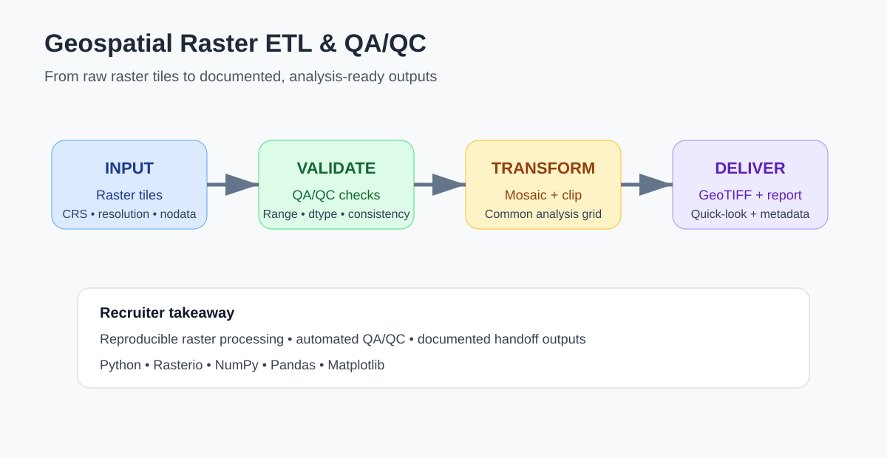

# Geospatial Raster ETL & QA/QC Pipeline

A reproducible Python workflow for turning multiple raster tiles into a documented, analysis-ready product with automated quality checks.



## Why this project matters

Applied geospatial work often starts with data that differ in extent, metadata, naming, nodata handling, or spatial structure. This project demonstrates a practical **extract-transform-load (ETL)** pattern for raster data and makes data quality visible before analysis.

## Workflow

1. Create or ingest raster tiles
2. Validate CRS, resolution, dtype, extent, and nodata metadata
3. Mosaic tiles into a common grid
4. Clip to an area of interest
5. Calculate QA/QC statistics
6. Export an analysis-ready GeoTIFF
7. Write a machine-readable QA report
8. Create a quick-look visualization for technical review

## Skills demonstrated

- Python geospatial processing
- Rasterio / NumPy / Pandas
- Raster mosaicking and clipping
- CRS and resolution validation
- Nodata and range checks
- Metadata and QA/QC reporting
- Reproducible project structure
- Technical handoff outputs

## Run

```bash
pip install -r requirements.txt
python src/demo.py
```

Outputs are written to `outputs/` and include an analysis-ready raster, QA report, and quick-look figure.

## Data note

The included demo creates small synthetic raster tiles so the workflow can be run anywhere without downloading external data. The same functions are designed to accept real GeoTIFF inputs from satellite, terrain, partner, or client data sources.

## Production extensions

For operational work, this pattern can be extended with cloud masking, reprojection, resampling, STAC metadata, Cloud Optimized GeoTIFF export, checksum logging, batch manifests, and cloud-object storage.

## Author

Priyanka Belbase | Geospatial Data Science | Remote Sensing | GIS | Python