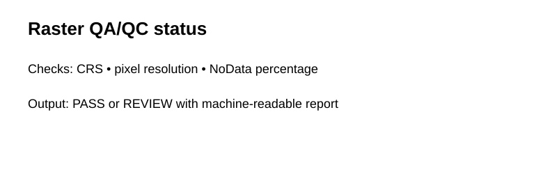

# Geospatial Raster ETL & QA/QC Pipeline

**Timeline:** Geospatial data-engineering context **2023–2025** • Public GitHub portfolio implementation **2026**

A compact data-engineering project demonstrating raster inventory checks, CRS/resolution validation, NoData screening, QA status reporting, and analysis-ready handoff logic.

> The committed inventory is synthetic metadata; the workflow is designed to be adapted to Rasterio/GDAL-backed raster collections.

## Outputs



## Run
```bash
pip install -r requirements.txt
python scripts/run_demo.py
python -m pytest -q
```

## Recruiter takeaway
This project emphasizes reliable geospatial data pipelines: metadata inspection, validation gates, issue reporting, and reproducible handoff before modeling begins.
