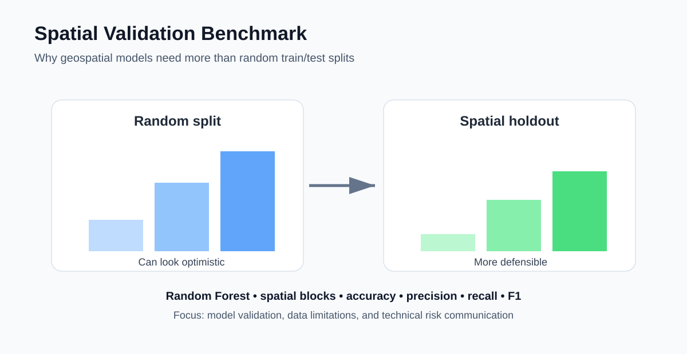

# Spatial Validation Benchmark for Geospatial Machine Learning

A reproducible benchmark showing how model performance changes when geospatial data are validated with **random splits versus spatially separated holdout blocks**.



## Why this project matters

Random train/test splits can overstate performance when nearby observations are spatially autocorrelated. This project demonstrates a practical way to detect that problem and communicate model risk clearly.

## Workflow

1. Generate or load georeferenced training samples
2. Engineer spectral and spatial predictor variables
3. Train a Random Forest classifier
4. Evaluate with a conventional random split
5. Evaluate with spatial-block holdout
6. Compare accuracy, precision, recall, and F1
7. Produce confusion matrices and a validation summary
8. Document the difference between the two validation strategies

## Skills demonstrated

- GeoAI / geospatial machine learning
- Python and scikit-learn
- Spatial autocorrelation awareness
- Random vs spatial validation
- Accuracy assessment
- Confusion matrices and F1 metrics
- Reproducible analytical workflows
- Technical risk communication

## Run

```bash
pip install -r requirements.txt
python src/demo.py
```

## Data note

The demo uses synthetic spatial samples so that the benchmark is fully reproducible. The same evaluation pattern can be applied to labeled satellite samples, field observations, survey points, or other spatial validation datasets.

## Production extensions

Useful extensions include k-fold spatial cross-validation, buffered holdouts, class imbalance handling, calibration, uncertainty mapping, and comparison of multiple classifiers.

## Author

Priyanka Belbase | GeoAI | Remote Sensing | Spatial Validation | Python