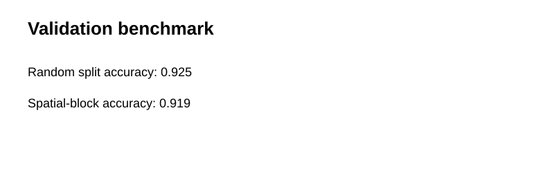
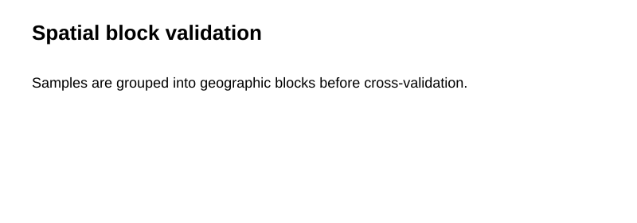

# Spatial Validation Benchmark for Geospatial ML

**Timeline:** Spatial-model validation development **2024–2025** • Public GitHub portfolio implementation **2026**

A reproducible benchmark showing how random train/test splitting can differ from **spatial-block validation**.

> Synthetic spatial samples are used to isolate the validation-design concept.

## Results
- Random split accuracy: **0.925**
- Spatial-block accuracy: **0.919**




## Run
```bash
pip install -r requirements.txt
python scripts/run_demo.py
python -m pytest -q
```
