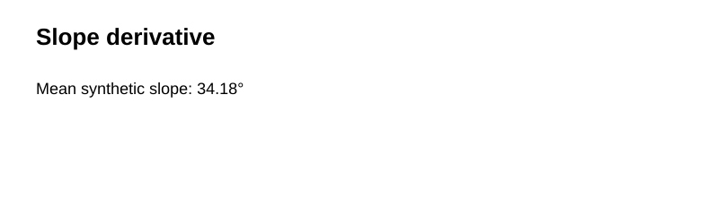
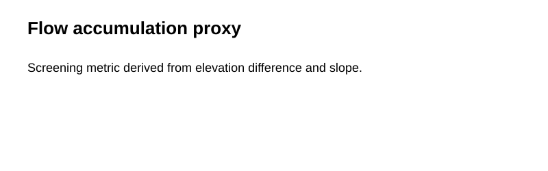

# Terrain & Hydrology Modeling Workflow

A reproducible DEM-based demonstration of terrain derivatives, slope, a flow-accumulation proxy, and a stream-network screening layer.

> The committed DEM is synthetic. It demonstrates workflow structure rather than replacing hydrologically conditioned DEM processing with specialist libraries.

| DEM | Slope |
|---|---|
|  |  |

| Flow proxy | Stream proxy |
|---|---|
|  |  |

## Run
```bash
pip install -r requirements.txt
python scripts/run_demo.py
python -m pytest -q
```

## Production extension
For operational hydrology, use conditioned DEMs, depression handling, D8/D∞ routing, watershed delineation, and validation in ArcGIS Pro, WhiteboxTools, GRASS GIS, or TauDEM.
