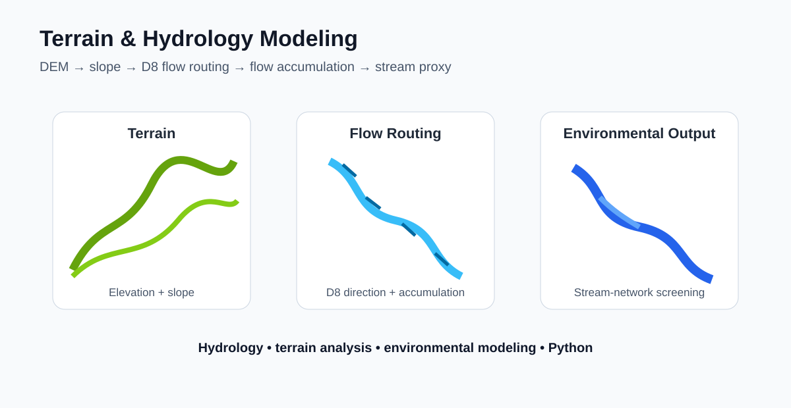

# Terrain & Hydrology Modeling Workflow

A reproducible terrain-analysis project that derives slope, flow direction, flow accumulation, and a simple stream-network proxy from a digital elevation model.



## Why this project matters

CGS works across land, water, conservation, and infrastructure. Terrain and hydrologic processing are common foundations for flood screening, watershed analysis, restoration planning, infrastructure siting, and environmental modeling.

## Workflow

1. Generate or ingest a DEM
2. Inspect elevation range and missing values
3. Fill simple depressions for a continuous drainage surface
4. Calculate slope
5. Estimate D8 flow direction
6. Calculate flow accumulation
7. Derive a high-accumulation stream proxy
8. Produce maps and summary statistics
9. Document assumptions and limitations

## Skills demonstrated

- DEM and terrain analysis
- Hydrologic modeling concepts
- Python / NumPy / Matplotlib
- D8 flow routing
- Flow accumulation
- Stream-network screening
- QA/QC and technical documentation
- Environmental modeling

## Run

```bash
pip install -r requirements.txt
python src/demo.py
```

## Data note

The demonstration generates a synthetic DEM so the workflow can run without external downloads. For real applications, the same pattern can be connected to USGS 3DEP, Copernicus DEM, LiDAR-derived terrain, or other elevation products.

## Limitations

This is a portfolio-scale implementation intended to demonstrate core processing logic. Operational hydrology should use production-grade depression treatment, edge handling, watershed delineation, calibrated thresholds, and independent validation.

## Author

Priyanka Belbase | Terrain Analysis | Hydrology | GIS | Environmental Modeling